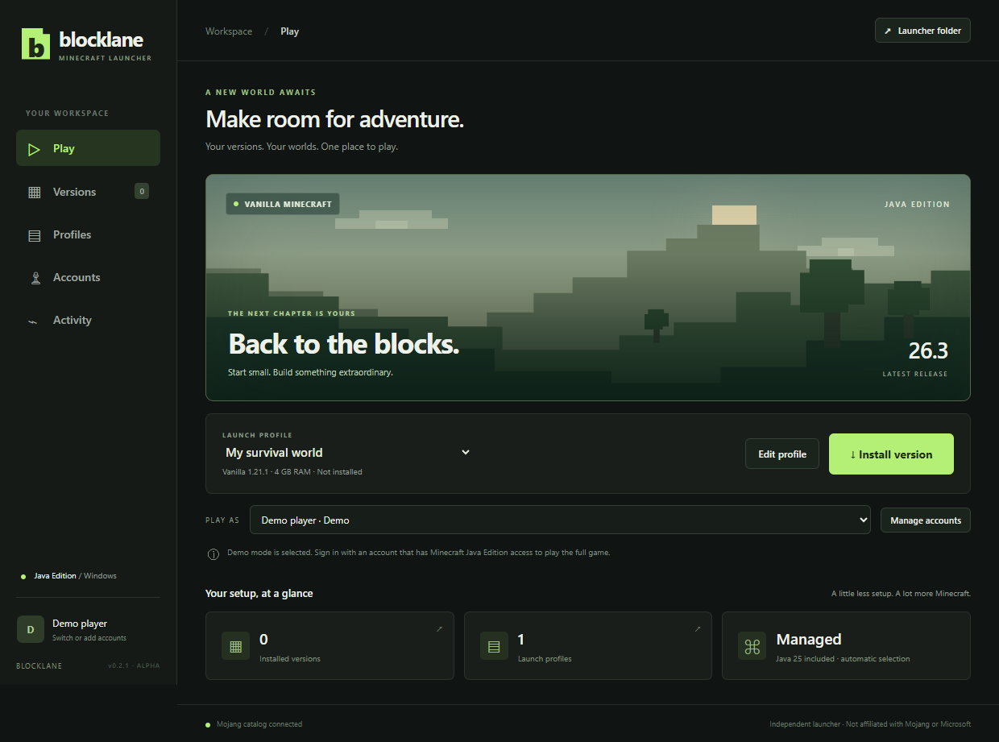

# Blocklane

An independent Minecraft Java Edition launcher for Windows x64. Blocklane installs and switches Minecraft versions with Vanilla, Fabric, Quilt, Forge, NeoForge, or LiteLoader profiles, includes Java in portable builds, and offers Demo plus Microsoft multi-account support.

**Status: early development, v0.4.24.** Microsoft OAuth, Xbox Live authentication, and XSTS authorization have succeeded in a live user test. Minecraft Services currently rejects Blocklane's application with HTTP 403. Application review is required before full-game sign-in can be validated. Demo remains available. Players never need to register an application or enter a client ID.



The preview uses test profile data. It does not show an authenticated game session.

## Features

- Mojang release/snapshot catalog, version search and filters, and cached metadata.
- Installation of every version in Mojang's Java Edition catalog, including releases, snapshots, old Beta, and old Alpha builds, with legacy asset layouts and matching Java runtimes.
- Checksum validation, reuse and repair of existing files, cancellation, and retries with bounded concurrent downloads.
- Profiles with pinned game versions, RAM allocation, Java selection, and separate worlds/settings.
- Fabric, Quilt, Forge, NeoForge, and LiteLoader profiles with compatible loader catalogs, pinned builds, installation/repair, and separate mods folders.
- Modrinth mod manager with loader/version-filtered search, checksum-verified installs, required dependencies, enable/disable, updates, removal, and local JAR visibility.
- Modrinth modpack browser and local `.mrpack` import with automatic profiles, checksum verification, staged installation, updates, rollback, and preservation of worlds and personal settings.
- A Shaders tab that appears for profiles with Iris (Fabric/Quilt) or Oculus (Forge/NeoForge), with compatible Modrinth shader packs filtered to the profile Minecraft version and stored in its own `shaderpacks` folder.
- Bundled Java 25 in portable Windows builds; automatic installation of matching Mojang runtimes for other versions.
- Automatic GitHub release checking at startup and a manual header check, with a direct link to the published installer when a newer version is available.
- Explicit Demo mode; Microsoft account switching/removal, entitlement checks, and encrypted local refresh-token storage.
- Electron sandboxing, context isolation, a restricted renderer bridge, and token redaction in game logs.

## Run from source

Install Node.js 22.12+ and npm, then run on Windows x64:

```powershell
npm ci
node node_modules/electron/install.js
npm start
```

Alternatively, double-click `Start Launcher.cmd`. The launcher downloads Minecraft files directly from Mojang when a version is installed. Game files and worlds are not included in this repository.

1. Create a launch profile and search the complete official version catalog.
2. Select RAM and leave Java set to `auto`.
3. Install the version.
4. Select Demo or a saved Microsoft account, then launch.

For modded play, choose Fabric, Quilt, Forge, NeoForge, or LiteLoader in the profile editor and select a compatible loader build. Click **Install profile**, then open **Mods** to search Modrinth for compatible mods. Blocklane installs the selected JAR and its required dependencies into the profile's isolated mods folder, and can enable, disable, update, or remove managed mods. When it detects Iris on Fabric or Quilt, or Oculus on Forge/NeoForge, the **Shaders** tab appears and installs compatible shader-pack ZIPs into that profile's isolated `shaderpacks` folder. Manually copied JARs and ZIPs are shown separately and are never deleted by Blocklane. See [MODS.md](MODS.md).

Loader availability comes from official repositories. A new Minecraft release may not have a compatible loader yet. Forge and NeoForge use their checksum-verified official client installers and processors inside Blocklane's own data directory. LiteLoader uses its official legacy 1.12.2 manifest; other legacy installer formats without a modern `version.json` are unsupported. See [LOADERS.md](LOADERS.md).

Microsoft account creation currently stops at the Minecraft Services approval restriction described above. An account without Java Edition access is not treated as a full-game account.

## Build a portable launcher

```powershell
npm run bundle-java
npm run package -- --release
```

The resulting folder is `dist/Blocklane-0.4.24-win32-x64/`; open `Blocklane.exe` and keep its supporting files beside it. Packaging includes Mojang's Java runtime and its license notices. The launcher is currently unsigned.

To make the Windows installer, run `npm run installer`. This uses electron-builder's NSIS target to produce `dist/nsis/Blocklane-0.4.24-Setup.exe`, which provides the standard Windows installation wizard, creates shortcuts, and includes the launcher plus its bundled Java runtime.

Blocklane's public application ID is embedded in `src/app-config.json`. Developers can override it with `BLOCKLANE_MICROSOFT_CLIENT_ID` at build time. A public desktop client does not use a client secret. The release packaging check verifies that an ID is configured; it does not verify service approval.

## Development and validation

```powershell
npm test
npm run smoke
```

The automated suite covers downloads, cancellation, archive handling, profiles/world preservation, Java runtimes, account persistence, token refresh, entitlement rejection, and service-specific error messages, loader installs, and Modrinth mod management. Authentication tests use simulated responses; they do not substitute for live sign-in approval. See [VALIDATION.md](VALIDATION.md).

Data lives under `%APPDATA%/blocklane`. Account tokens are encrypted locally with Electron safeStorage/Windows DPAPI. Profiles and game files live under `minecraft/`; worlds remain under `minecraft/instances/<profile-id>/saves` when a profile is removed. `BLOCKLANE_DATA_DIR` provides an isolated data-directory override.

## Scope

Java Edition profiles can select every version in Mojang's official catalog, including historical Alpha and Beta entries. Fabric, Quilt, Forge, NeoForge, and LiteLoader remain limited to the Minecraft versions published by their own catalogs; LiteLoader is restricted to Minecraft 1.12.2. Bedrock and in-app update installation are future work. Historical versions may still have game-specific compatibility limitations on modern Windows. Full authenticated gameplay is pending Minecraft Services access approval. See [MODPACKS.md](MODPACKS.md) for pack-management behavior.

See [Microsoft application setup](MICROSOFT-SETUP.md), [privacy information](PRIVACY.md), and [security reporting](SECURITY.md).

Blocklane is not affiliated with or endorsed by Mojang Studios or Microsoft. Minecraft game binaries and assets are downloaded from their official services rather than redistributed here. Blocklane source is licensed under [MIT](LICENSE); third-party dependencies and Java retain their own licenses.


